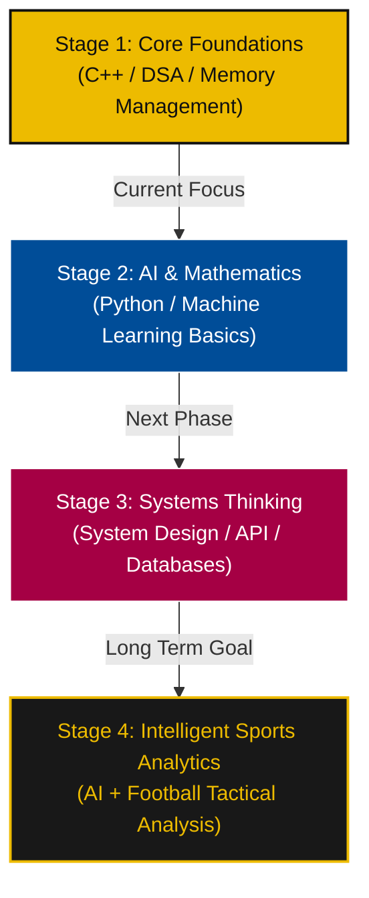

# ⚽ Hola, I'm Saiyash Poojari! 

  
  
  <h3>🔵🔴 Mes que un Developer 🔴🔵</h3>
  
<strong>B.Tech First-Year Student | Systems Engineering | AI & Sports Analytics | C++ Specialist</strong>

  
  
  
  

---

### 🏟️ Scouting Report & Philosophy

I approach computer science with the tactical discipline of a football playbook—focusing on core logic and low-level understanding over quick frameworks. 

- 🎓 **Current Club:** First-Year B.Tech Student in Mumbai, India.
- ⚽ **Tactical Vision:** Integrating Machine Learning and Computer Vision with football performance and player positioning analysis (Sports Analytics).
- 🧠 **Playstyle:** Deep systems engineering, efficient memory management, and structured algorithmic problem-solving.
- ⚡ **Tactics:** Consistency beats intensity. Small daily progress, logic first, and building before consuming.

---

### 🛠️ Tactical Formation (Tech Stack)

<table>
  <tr>
    <td valign="top" width="50%">
      <h4>🌟 Midfield Control (Core Foundations)</h4>
      <code>C++</code> • <code>Data Structures & Algorithms</code> • <code>Pointers & Memory</code> • <code>Problem Solving</code>
    </td>
    <td valign="top" width="50%">
      <h4>🏃 Wide Attackers (Web Stack)</h4>
      <code>JavaScript (ES6+)</code> • <code>React.js</code> • <code>Tailwind CSS v4</code> • <code>HTML5 & CSS3</code> • <code>Framer Motion / GSAP</code> • <code>Git</code>
    </td>
  </tr>
  <tr>
    <td valign="top" width="50%">
      <h4>🔮 Future Transfers (Future Vision)</h4>
      <code>Python</code> • <code>Machine Learning Basics</code> • <code>AI Systems</code> • <code>Advanced Mathematics</code>
    </td>
    <td valign="top" width="50%">
      <h4>📊 Sports Tech (Analytics)</h4>
      <code>Sports Analytics</code> • <code>Data Visualization</code> • <code>Performance Metrics</code> • <code>Football Intelligence</code>
    </td>
  </tr>
</table>

---

### 📊 Match Statistics (GitHub Stats)

  <table border="0">
    <tr>
      <td align="center">
        
      </td>
      <td align="center">
        
      </td>
    </tr>
  </table>
  
   
  
  

---

### 🏆 Project Squad (Featured Repositories)

* **[DEUTSCH MEISTER](https://deutsch-meister-xi.vercel.app)** - A comprehensive, gamified Duolingo-style learning application designed to guide users from A1 to C2 German proficiency. Features a custom Gemini-powered AI tutor, interactive exercises, and cloud progress tracking.
* **[Array Toolkit](https://github.com/saiyash07/DSACPP)** - A comprehensive C++ library implementing foundational array operations entirely from scratch, focusing on low-level memory layout, pointer arithmetic, and algorithmic efficiency.
* **[Inventory Management Case Study](https://github.com/saiyash07/InventoryManagementCaseStudy)** - A menu-driven C++ system simulating enterprise inventory control using structures, arrays, and control flow.
* **[AI Football Analytics](https://github.com/saiyash07/AI-FOOTBALL-ANALYTICS)** - A planned machine learning system to analyze player movement, pitch-control maps, and passing networks from match footage.

---

### 📈 Tactical Roadmap (Career Progression)

---

### 📞 Connect (Send a Pass ⚽)

- 📧 **Email:** [poojarisaiyash@gmail.com](mailto:poojarisaiyash@gmail.com)
- 💼 **LinkedIn:** [Saiyash Poojari](https://www.linkedin.com/in/saiyashpoojari/)
- 📸 **Instagram:** [@saiyaas.hh](https://www.instagram.com/saiyaas.hh/)
- 📱 **Phone:** [+91 84540 34440](tel:8454034440)
- 📍 **Location:** Mumbai, India

  Built with 💙 ❤️ and 💛 by Saiyash Poojari

